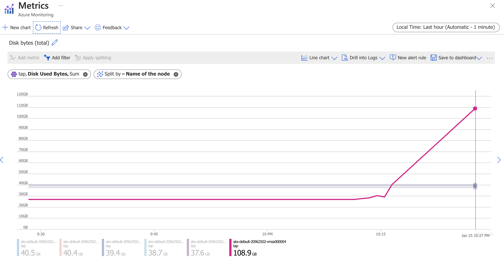

# Kaniko issue on TAP: disk full

This project highlights a Kaniko issue
([GH-2203](https://github.com/GoogleContainerTools/kaniko/issues/2203)) 
with Dockerfile when building containers on
[VMware Tanzu Application Platform](https://tanzu.vmware.com/application-platform).

This issue only happens with multi-stage builds, when copying files
from a directory containing "special" files such as `/dev/zero`.

This usually happens when you have these instructions in your Dockerfile:

```Dockerfile
FROM myimage1 as source

FROM myimage2
COPY --from=source / .
```

The `COPY` instruction is the root cause of this issue, since Kaniko
would copy files such `/dev/zero`, ending up with an endless copy.

Moreover, the default configuration for Kaniko-based builds on TAP relies on
a Tekton workspace, which is mounted using ephemeral storage
(using `emptyDir`). As a result, the host disk providing the workspace will
be full of zeroes in no time.

For example, here's the result of running this workload on TAP with AKS:



In a few minutes, worker node disk space is full.

There is no fix for the Kaniko issue at the moment.

In order to mitigate this issue, **make sure you copy only files you need
in your Dockerfile**.

## Contribute

Contributions are always welcome!

Feel free to open issues & send PR.

## License

Copyright &copy; 2023 [VMware, Inc. or its affiliates](https://vmware.com).

This project is licensed under the [Apache Software License version 2.0](https://www.apache.org/licenses/LICENSE-2.0).
